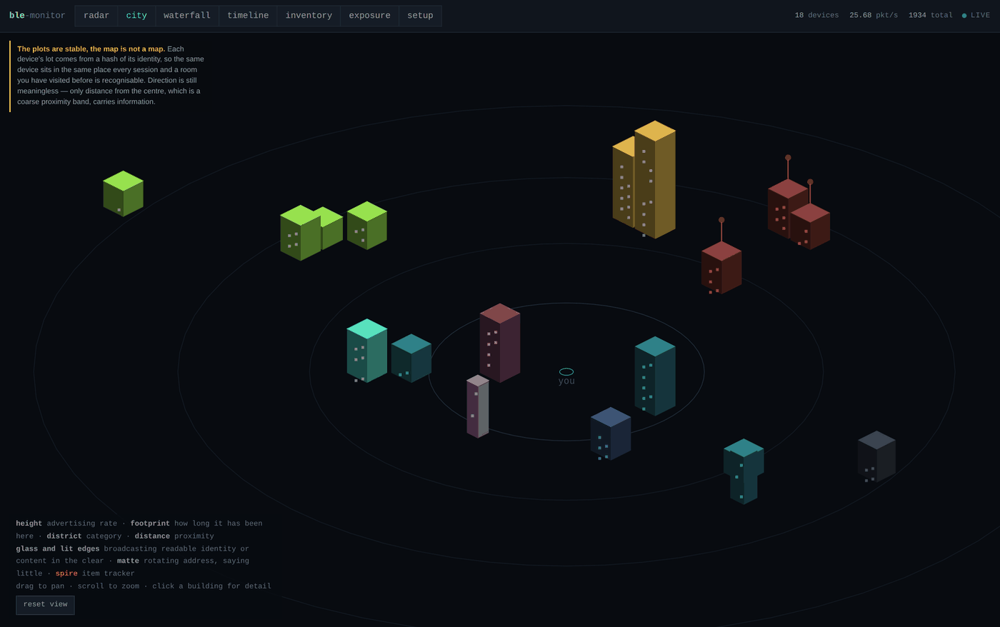
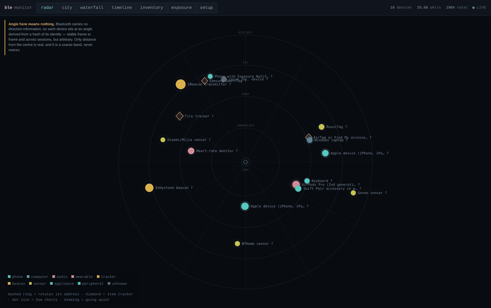
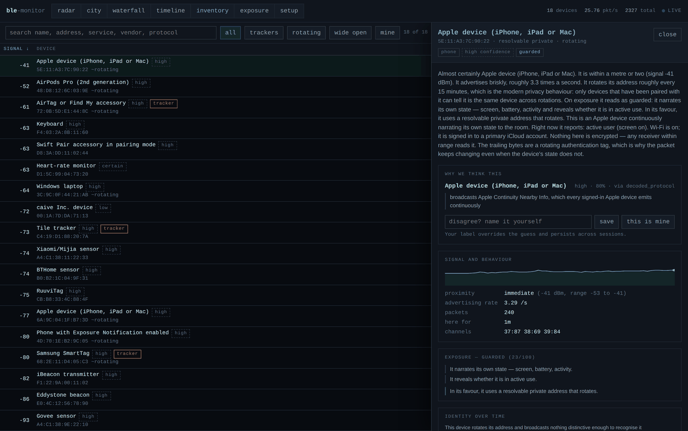
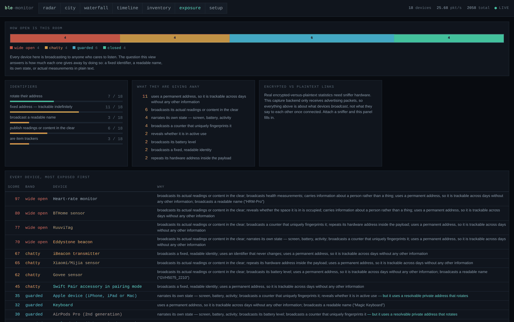
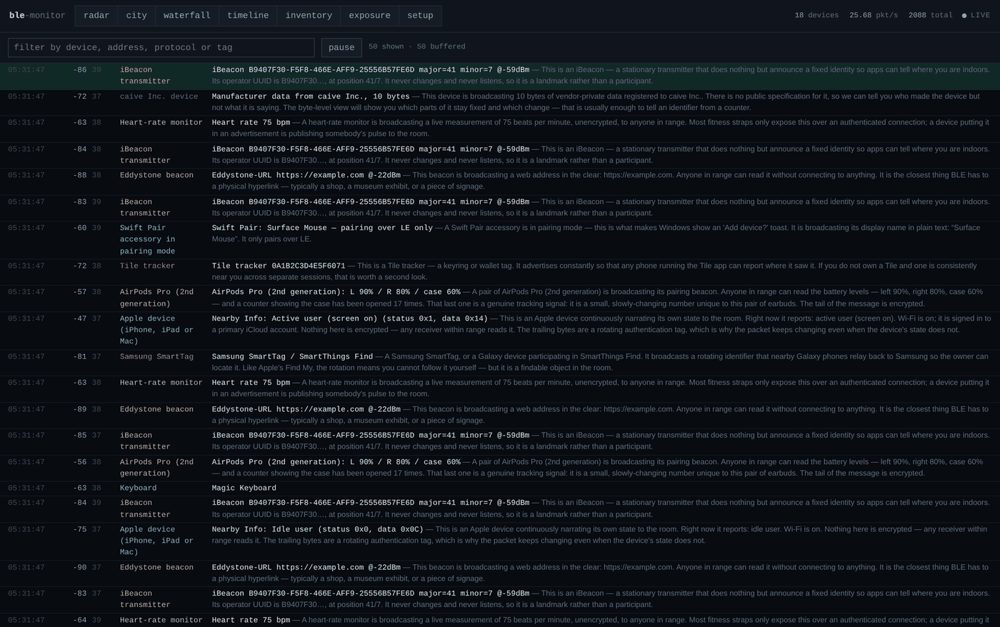

# ble-monitor

**See the Bluetooth Low Energy traffic around you.**

Every public space is saturated with BLE radio chatter. Phones announcing what
their owner is doing, earbuds broadcasting their battery level, trackers
calling out to be found, sensors publishing the temperature of the room they
are in. Your phone receives thousands of these an hour and throws them all
away.

This makes that traffic visible, and — more importantly — legible.

<p align="center">
  
</p>

---

## What it does

- **Two co-equal hero views.** A radar showing what is around you *right now*,
  and an isometric city where the skyline *is* the radio environment. Each
  device's plot in the city comes from a hash of its identity, so it lands on
  the same lot every time — walk back into the same café and the shape is
  recognisable before you read a single label.
- **Deep protocol decoding.** Apple Continuity, iBeacon, Find My, Eddystone,
  Google Fast Pair and Find My Device, Microsoft Swift Pair and CDP, Tile,
  SmartTag, BTHome, Xiaomi MiBeacon, Ruuvi, Govee, and the standard GATT
  services — plus every AD type, with unknown payloads shown as annotated hex.
- **A plain-English layer on everything.** Not a field table: a sentence
  saying what the device is doing and why it matters.
- **Guesses that look like guesses.** Every identification carries a confidence
  level, the runners-up, and the concrete observations behind it. You can
  disagree and your label wins.
- **An exposure dashboard.** How much of this room is broadcasting readable
  identity, state or content in the clear — and how much is shut tight.
- **Tracker awareness.** Known tracker hardware on sight, plus an alert when an
  unidentified rotating-address device keeps turning up near you.
- **Live and recorded.** Stream over WebSocket, persist to SQLite, replay a
  recorded session through the live views at adjustable speed.
- **A first-class CLI.** Everything the dashboard does, you can do over SSH.

---

## Quick start

```bash
uvx ble-monitor serve --open
```

That is the whole thing. It picks the most capable capture backend available,
starts the service, and opens the dashboard.

**No hardware yet?** It still works:

```bash
uvx ble-monitor serve --backend synthetic --open
```

…which generates a believable café — phones, earbuds, trackers, beacons,
sensors, people arriving and leaving — using the real payload formats, so every
view and every decoder behaves exactly as it would on live traffic. It is
labelled as synthetic everywhere it appears.

**Before anything else, run:**

```bash
blemon doctor
```

It says exactly what your setup can and cannot see, and how to fix whatever is
missing. A monitor showing an empty screen is indistinguishable from a quiet
room; `doctor` tells you which one you are looking at.

---

## What you need to see what

This is the part most tools are vague about, so here it is plainly.

| | Host adapter (Linux) | Host adapter (macOS) | Sniffer (Sniffle) |
|---|---|---|---|
| Advertising packets | ✅ | ✅ | ✅ |
| Real MAC addresses | ✅ | ❌ **hidden by macOS** | ✅ |
| Address-type / privacy analysis | ✅ | ❌ | ✅ |
| Unmodified raw payloads | ✅ | ⚠️ reconstructed | ✅ |
| BT5 extended advertising | ✅ | ❌ | ✅ |
| Correlate across MAC rotation | ✅ | ❌ | ✅ |
| All three ad channels at once | ❌ | ❌ | ✅ (for a target) |
| Per-packet channel numbers | ❌ | ❌ | ✅ |
| **Connection traffic** | ❌ | ❌ | ✅ |

Two things worth understanding:

**A host Bluetooth adapter only ever sees advertising.** Once two devices
actually connect, they leave the three advertising channels and start hopping
across thirty-seven others in a pattern only they know. No ordinary adapter can
follow that. Seeing what devices *say to each other*, rather than what they
shout at everyone, is the one thing that genuinely requires sniffer hardware.

**macOS hides MAC addresses.** CoreBluetooth substitutes a UUID generated per
application, so on a Mac you cannot tell a permanently-trackable device from
one carefully rotating its address every fifteen minutes, correlation across
rotation is impossible, and two captures cannot be compared. This is the
platform, not the tool. The Mac makes an excellent screen for a Raspberry Pi's
radio — see below.

---

## Installing

### macOS

```bash
uv tool install ble-monitor      # or: pipx install ble-monitor
blemon doctor
blemon serve --open
```

macOS will ask for Bluetooth permission the first time. If no devices ever
appear, permission was denied — System Settings › Privacy & Security ›
Bluetooth.

### Raspberry Pi (the recommended place to run it)

```bash
sudo apt install -y python3-pip
uv tool install ble-monitor

# Grant the radio capabilities rather than running everything as root:
sudo setcap 'cap_net_raw,cap_net_admin+eip' "$(readlink -f "$(which python3)")"

blemon doctor
blemon serve --host 0.0.0.0
```

Then open `http://<pi-address>:8420` from your Mac, your laptop or your phone.
`--host 0.0.0.0` is an explicit opt-in and the service says so loudly when you
use it: anyone on your network can then reach the dashboard and everything it
has captured.

#### Headless, always-on

A systemd unit is provided in [`deploy/ble-monitor.service`](deploy/ble-monitor.service):

```bash
sudo cp deploy/ble-monitor.service /etc/systemd/system/
sudo systemctl enable --now ble-monitor
journalctl -u ble-monitor -f
```

---

## Buying a sniffer

You do not need one to get a lot out of this. You do need one to see
connection traffic.

**Recommended: SONOFF ZBDongle-P** (about £20/$25) flashed with
[Sniffle](https://github.com/nccgroup/Sniffle).

> ⚠️ Get the **-P**, not the **-E**. The ZBDongle-P is TI CC2652P silicon and
> works. The ZBDongle-E is Silicon Labs EFR32 and will not, and the two look
> nearly identical in a shop listing.

Also supported: TI CC1352P7 / CC26x2R LaunchPad, CatSniffer v3.

**Already own an nRF52840 dongle?** It works, via Nordic's own nRF Sniffer
firmware, but it is the weaker option — it listens on one advertising channel
at a time, so you see roughly a third of any device's advertisements.

`blemon doctor` auto-detects attached hardware, reports its firmware state, and
prints the flashing instructions for whichever one you have.

Once a sniffer is attached, pick any device in any view and aim the spotlight at
it (right-click in the city, or the button in its detail panel, or
`blemon follow <address>`). **One sniffer follows one connection at a time** —
advertising capture is broad and continuous, connection following is a
spotlight you aim. Attach a second sniffer to aim a second one.

---

## The views

### Radar — what is around me right now



Devices are placed by signal strength, drifting as they move, dimming as they
go quiet, pulsing on their own advertising rhythm. Dashed rings mark devices
that rotate their address; diamonds are item trackers.

Two constraints are built into this view rather than mentioned in a footnote:

- **Bluetooth carries no bearing.** A radar implies direction and we do not
  have it. Each device's angle is derived from a hash of its identity so it
  stays put frame to frame and across sessions — and the view says permanently
  that the angle is arbitrary.
- **Signal strength does not convert reliably to distance.** So the rings are
  coarse bands — immediate, near, far, distant — and no metre figure appears
  anywhere in the tool.

### City — what does this place look like


| Encoding | Meaning |
|---|---|
| Height | Advertising rate — chatty devices are skyscrapers |
| Footprint | How long it has been observed — persistent devices become landmarks |
| District | Category and manufacturer |
| Distance from centre | Proximity band |
| Lit windows | Advertised in the last few seconds |
| **Glass** | Broadcasting readable identity or content **in the clear** |
| **Matte** | Rotating address, saying little |
| Spire | Item tracker |

Click a building for its full detail. Right-click to aim the sniffer at it.

### Device detail — the reasoning, always



Every guess shows its confidence, its runners-up, and the concrete observations
behind it. Disagree and your label persists across sessions.

### Exposure — how much of this is in the clear



### Waterfall and inventory



---

## The CLI

Everything works over SSH. Every query command takes `--json`.

```bash
blemon doctor                        # what can this setup see, and why not more
blemon scan                          # live table of nearby devices
blemon scan --feed                   # scrolling packet feed instead
blemon watch <address>               # full decode of one device's packets
blemon devices --trackers --json     # query recorded history
blemon sessions                      # list recorded capture sessions
blemon follow <address>              # aim a sniffer at one device's connection
blemon probe <address>               # ACTIVE: connect and enumerate GATT
blemon export --format pcap -o c.pcap
blemon serve --host 0.0.0.0          # service + dashboard
blemon stored                        # exactly what is on this machine
blemon purge                         # delete all of it
```

Replay a recorded session through the live views:

```bash
blemon scan --backend replay --session-id 3 --speed 4
```

---

## Active probing

Everything else in this tool is receive-only. Probing is the one exception and
it is deliberately awkward to trigger by accident:

- Never called by the capture loop or any background task.
- Requires an explicit action every single time.
- **Connecting is visible to the target device.** It may be logged, it may
  prompt its user, and it briefly interrupts what the device was doing. The
  warning is in the result, not buried in documentation.
- Allowlist mode (the default in the UI) restricts probing to hardware you have
  marked as your own.
- There is no bulk mode.

What you get for it is a large jump in identification quality: exact model,
manufacturer, firmware revision, battery level, and the real service list
rather than whatever the device chose to advertise.

The dashboard's probe button is off unless you start the service with
`--allow-probe`.

---

## Responsible use

This tool passively receives public broadcasts — the same advertisements every
phone in your pocket receives and discards continuously. It is built for
understanding your own radio environment and for security research.

Built in, not bolted on:

- **All data stays on this machine.** No network egress, no telemetry, ever.
  The reference tables are vendored; nothing is fetched at runtime.
- **Passive by default.** Active probing is gated as described above.
- **Retention is bounded by default**, not opt-in. There is a view showing
  exactly what is stored and a single control that destroys it.
- **Exports offer MAC redaction** — a keyed hash, consistent within one file so
  the data stays analysable, uncorrelatable across two files, and applied to
  device names and the prose around them as well as to the address fields.
- **Correlation across MAC rotation is deliberately conservative.** It refuses
  to link devices whose payloads are not distinctive, because merging two
  strangers' phones would be worse than counting one phone twice. It is always
  presented as a confidence-scored inference with its evidence attached.

Indefinitely logging identifiable strangers is not the intent, and the defaults
are set so that it does not happen by accident.

---

## How BLE advertising actually works

A short primer, because the tool should teach rather than just display.

Every BLE device that wants to be findable broadcasts a short packet a few
times a second on three fixed channels — 37, 38 and 39 — addressed to nobody.
That is what you are watching. It is entirely public.

What goes in that packet is up to the device. Some announce a name, a battery
level and what their owner is doing right now. Others rotate a random
identifier every fifteen minutes and say nothing else. The distance between
those two is what the exposure view measures.

Addresses come in four flavours, and which one a device uses is the single most
informative privacy signal in the packet:

| Type | What it means |
|---|---|
| **Public** | A permanent, globally unique hardware address. Trackable forever. |
| **Random static** | Fixed until reboot. Better, still followable. |
| **Resolvable private** | Rotates every ~15 minutes. Only paired devices can link them. |
| **Non-resolvable private** | Fully random, unlinkable by anyone. |

Once two devices connect, they leave the advertising channels behind and hop
across thirty-seven data channels in a sequence derived from parameters
exchanged during connection setup. Following that needs a sniffer that saw the
setup.

---

## Architecture

The capture service is the product; the dashboard is one client of it.

```
capture/    radio access. Backends declare capabilities; nothing above this
            layer may assume a capability that was not declared.
decode/     bytes -> structured, named fields. Pure functions, no I/O.
identity/   structured fields -> ranked guesses with evidence. Never facts.
translate/  everything above -> one or two sentences of ordinary English.
store/      SQLite persistence, sessions, retention, export.
service/    HTTP + WebSocket API. Headless. The UI is strictly a client.
cli/        a first-class terminal interface.
web/        TypeScript + React, built into the Python package.
```

Every layer is a registry-driven plugin point. Adding a protocol decoder, an
identification matcher or a capture backend is one decorated function or class:

```python
from blemon.decode.registry import manufacturer_decoder
from blemon.models import Decoding

@manufacturer_decoder(0x1234)
def decode_my_vendor(data: bytes, context: dict) -> list[Decoding]:
    return [Decoding(protocol="my_vendor", summary="...", english="...")]
```

---

## Development

```bash
git clone https://github.com/harperjosh/ble_monitor
cd ble_monitor
uv venv && uv pip install -e ".[dev]"
npm --prefix web install && npm --prefix web run build
pytest
```

The built dashboard is committed inside the Python package, so installing
ble-monitor never requires a Node toolchain. You only need Node to change the
web app.

The entire decode, identification and translation stack is verifiable in CI
with no radio hardware present — payload fixtures are constructed with real
framing, so the tests exercise the AD parser as well as the protocol decoders.

---

## Licence

MIT. See [LICENSE](LICENSE).

Bluetooth SIG assigned numbers under `src/blemon/data/` are snapshots of the
public allocations published by the Bluetooth SIG and Nordic Semiconductor's
`bluetooth-numbers-database`.
